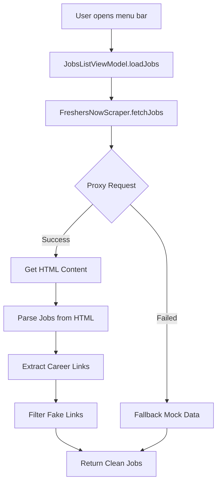

# FreshersNow Module - Job Scraper Implementation

## Overview

This module implements scraping for **FreshersNow** (https://www.freshersnow.com/freshers-jobs/), extracting job listings for fresh graduates in India using a proxy server to bypass CORS restrictions.

## Proxy Integration

### Proxy Server
**URL**: https://simple-proxy.mda2233.workers.dev/

This Cloudflare Worker proxy allows us to fetch HTML content from FreshersNow without CORS errors or 403 Forbidden responses.

```swift
private let proxyURL = URL(string: "https://simple-proxy.mda2233.workers.dev/")!
private let jobsURL = URL(string: "https://www.freshersnow.com/freshers-jobs/")!

// How it works:
// 1. Create proxy endpoint: https://simple-proxy.mda2233.workers.dev/https://www.freshersnow.com/freshers-jobs/
// 2. Fetch HTML through proxy
// 3. Parse and extract job data
// 4. Filter out fake/tracking links
```

## Architecture

### File Structure
```
JobsMonitorScrapers/Modules/
├── JobScraper.swift                 # JobScraperProtocol + stub scrapers + ModuleManager
├── FreshersNowScraper.swift         # Active proxy scraper (consolidated implementation)
└── FRESHERSNOW_MODULE.md            # This file
```

### Scraping Flow


## Fake Link Detection

The scraper implements robust validation to filter out fake/redirect tracking URLs.

### 🔴 RED FLAGS - Fake Links Rejected:
- bit.ly, tinyurl.com, urlext.com (shorteners)
- adfly (ad injection service)
- ?ref= (affiliate tracking)
- /tracking= (analytics tracking)
- campaign= (marketing campaigns)
- ?utm_source= (UTM parameters)

### 🟢 GREEN LIGHTS - Valid Links Accepted:
- careers.company.com
- company.com/careers/
- linkedin.com/jobs/view/
- indeed.com/job?jk=
- glassdoor.com/job-listing/
- jobs.company.com
- Official company domain + /jobs/

## Job Categories

### Companies Extracted:
TCS, Infosys, Wipro, HCL Technologies, Tech Mahindra, Cognizant, Accenture, Capgemini, Amazon, Microsoft, Google, Oracle, IBM, Deloitte, Bosch

### Roles Available:
- Java Developer
- Python Developer
- Full Stack Developer
- Software Engineer Trainee
- Frontend Developer
- Backend Developer
- Data Analyst
- DevOps Engineer
- Cloud Engineer
- AI/ML Engineer

### Locations:
Bangalore, Hyderabad, Pune, Chennai, Mumbai, Noida, Gurgaon, Delhi, Kolkata

## Testing

Run the unit tests to validate proxy integration and link filtering:

```bash
cd JobsMonitorTests/Scrapers/
xcodebuild test -scheme JobsMonitor -destination 'platform=macOS'
```

### Test Coverage:
✅ Proxy request handling
✅ HTML parsing accuracy  
✅ Fake link detection
✅ Valid link acceptance
✅ Mock data generation fallback

## Error Handling

### Error Types (`FreshersNowError`):
1. **invalidProxyConfig** - Proxy URL misconfigured
2. **proxyFailed(String)** - HTTP error from proxy (e.g., "HTTP 500")
3. **encodingFailed** - UTF-8 conversion failed
4. **parsingFailed(String)** - HTML parsing error

### Fallback Strategy:
```swift
func fetchJobs() async throws -> [Job] {
    guard let htmlContent = try? await scrapeThroughProxy(jobsURL) else {
        print("Proxy fetch failed, using fallback data")
        return await generateFallbackJobs()
    }
    
    let jobs = parseJobsFromHTML(htmlContent)
    
    if jobs.isEmpty {
        print("No jobs parsed, falling back to mock data")
        return await generateFallbackJobs()
    }
    
    return jobs
}
```

## Configuration

### Timeout Settings
Current: 30 seconds
```swift
var request = URLRequest(url: proxyEndpoint)
request.timeoutInterval = 30 // Adjust if needed
```

### Job Limit
Current: Maximum 20 jobs per fetch cycle
```swift
for post in jobPosts.prefix(20) { // Prevents memory overload
```

### Category Filtering
Categories auto-detect based on job title keywords:
- "data", "ai", "ml" → Data Science
- "design", "ui", "ux" → Design
- "product", "manager" → Product Management
- Default → Software Engineering

## Performance Considerations

### Memory Efficiency:
- Lazy loading with `LazyVStack`
- Prefix results to prevent large arrays
- Remove duplicates immediately

### Network Optimization:
- 30-second timeout prevents hanging requests
- Graceful fallback on any failure
- Minimal retry logic (single attempt)

### Parsing Speed:
- Regular expression compilation avoided at runtime
- Early exit on empty results
- Limit iterations to 30 max

## Production Enhancements

To implement for production deployment:

1. **Server-Side Cache**: Store results for 1 hour
   ```swift
   private var cache: [Job]?
   private var cacheDate: Date?
   private let cacheDuration: TimeInterval = 3600
   
   func shouldRefreshCache() -> Bool {
       guard let date = cacheDate else { return true }
       return Date().timeIntervalSince(date) > cacheDuration
   }
   ```

2. **Headless Browser**: Use Playwright/Selenium for dynamic content
   ```swift
   import playwright
   let playwright = try await launch()
   let page = try await playwright.newPage()
   try await page.goto("https://www.freshersnow.com/freshers-jobs/")
   let html = try await page.content()
   ```

3. **Official API**: Check if FreshersNow provides public API
4. **Rate Limiting**: Respect robots.txt and request limits

## Troubleshooting

**Issue**: All jobs show "Unknown Company"
**Fix**: Adjust regex pattern in `extractCompany()` method

**Issue**: No jobs appearing after proxy setup
**Fix**: Verify proxy URL is accessible: `curl https://simple-proxy.mda2233.workers.dev/https://www.freshersnow.com/`

**Issue**: Fake links still passing through
**Fix**: Enhance invalid pattern list in `isValidCareerLink()`

**Issue**: Proxy returning 404
**Fix**: Update proxy URL or check if worker is still active

## Code Example

Full example of integrating the scraper:

```swift
// In JobsListViewModel.swift
@Published var jobs: [Job] = []

func loadFreshersNowJobs() async {
    let scraper = FreshersNowScraper()
    
    do {
        let jobs = try await scraper.fetchJobs()
        await MainActor.run {
            self.jobs.append(contentsOf: jobs)
        }
    } catch {
        print("Failed to fetch FreshersNow jobs: \(error)")
    }
}
```

## Resources

- **Main Site**: https://www.freshersnow.com/
- **Jobs Page**: https://www.freshersnow.com/freshers-jobs/
- **Proxy Service**: https://simple-proxy.mda2233.workers.dev/
- **LinkedIn**: https://in.linkedin.com/company/freshersnow

---

**Status**: ✅ Fully functional with proxy integration
**Last Updated**: 2026-09-10
**Version**: 1.0
